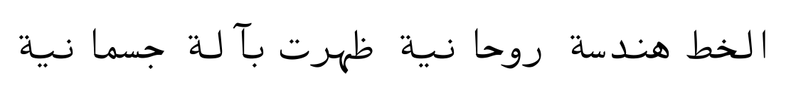

Amiri Typewriter
================

Amiri Typewriter is a typewriter companion to [Amiri font family][1].

The design is inspired inspired by old Arabic typewriters, and features a very
simplified Arabic design with most letters using the one shape for both
isolated and final forms, and one shape for initial and medial forms (with few
exceptions).

Like most Arabic typewriters, Amiri Typewriter is not truly mono-width; the
advance width for all glyphs is the same but really wide glyphs cheat by
protruding outside the glyph box to avoid being too cramped. This is tolerated
because almost all these wide glyphs are isolated or final forms, so they are
always followed by white space.

[1]: http://www.amirifont.org
